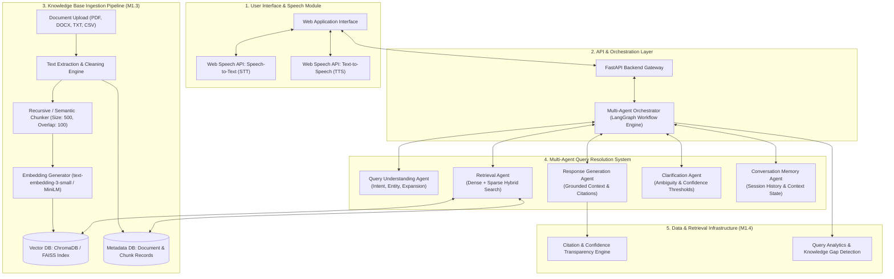

# Development of AI-Based Knowledge Retrieval Platform with Query Resolution System


---

## 📌 Executive Summary

The **AI-Based Knowledge Retrieval Platform with Query Resolution System** is an enterprise-grade, multi-agent Retrieval-Augmented Generation (RAG) platform designed for accurate, context-aware information extraction, voice interaction, and multi-domain query resolution.

By leveraging a decoupled **5-Agent Architecture** (Query Understanding, Retrieval, Response Generation, Clarification, and Conversation Memory Agents), the platform resolves complex queries across diverse file formats (`PDF`, `DOCX`, `TXT`, `CSV`) with strict hallucination control, confidence transparency, source citations, and voice input/output via the Web Speech API.

---

## 📅 Milestone 1 Overview: Foundation & Knowledge Retrieval

Milestone 1 establishes the baseline technical research, system architecture, multi-format document ingestion pipeline, and RAG retrieval validation framework across two distinct domain datasets.

```
       ┌────────────────────────────────────────────────────────────────────────┐
       │                       MILESTONE 1 ROADMAP                              │
       ├──────────────┬──────────────────┬──────────────────┬───────────────────┤
       │   M1.1       │      M1.2        │      M1.3        │       M1.4        │
       │ Research &   │     System       │ Knowledge Base   │   RAG Retrieval   │
       │ Technical    │   Architecture   │    Ingestion     │    Pipeline &     │
       │ Insights     │    & Schemas     │     Module       │    Validation     │
       └──────────────┴──────────────────┴──────────────────┴───────────────────┘
```

---

## 📑 Technical Architecture & Design (M1.2)

### High-Level System Architecture



---

## 🤖 Agent Roles & Responsibilities

| Agent | Core Responsibility | Input | Output | Key Techniques |
| :--- | :--- | :--- | :--- | :--- |
| **1. Query Understanding Agent** | Analyzes query intent, extracts entities, performs query expansion, and reformulates conversational queries. | Raw user query + conversation context | Structured query intent, sub-queries, filters | HyDE, NLTK/Spacy entity extraction, Synonym expansion |
| **2. Retrieval Agent** | Executes multi-modal semantic retrieval across vector store and metadata indexes. | Refined queries & domain metadata filters | Top-K document chunks with similarity scores | Cosine similarity, HNSW indexing, Hybrid Dense-Sparse Search |
| **3. Response Generation Agent** | Synthesizes grounded, accurate answers strictly adhering to retrieved chunk context. | Query + Top-K Context Chunks | Synthesized answer, source citations, confidence score | RAG Prompt Engineering, Citation linking, Hallucination checks |
| **4. Clarification Agent** | Evaluates retrieval confidence score; triggers follow-up prompts if query is ambiguous or information is missing. | Retrieval confidence, user query | Clarification request or proceed flag | Confidence score thresholding (<0.65 triggers clarification) |
| **5. Conversation Memory Agent** | Maintains session dialogue history, summarizes long interactions, and resolves coreferences. | Chat history logs, current query | Augmented conversational state | Sliding window memory, LLM-based state summarization |

---

## 🔄 End-to-End Data Flow

### Ingestion Pipeline Flow
1. **Document Upload**: User uploads `.pdf`, `.docx`, `.txt`, or `.csv` files via UI/API.
2. **Text Extraction & Cleaning**:
   - `PDF`: Parsed via `pdfplumber`/`pypdf`.
   - `DOCX`: Parsed via `python-docx`.
   - `TXT`/`CSV`: Read using `pandas` and encoding detection (`chardet`).
   - Normalization removes extra whitespace, artifacts, and repairs broken encoding.
3. **Chunking**: Document text is partitioned using **RecursiveCharacterTextSplitter** with chunk size $N = 500$ tokens and overlap $O = 100$ tokens.
4. **Embedding Generation**: Chunks are passed to embedding model (`text-embedding-3-small` / `all-MiniLM-L6-v2`) generating 1536/384-dimensional dense vectors.
5. **Indexing**: Embeddings along with chunk metadata (document ID, page number, domain, file format, timestamp) are stored in ChromaDB/FAISS.

### Retrieval & Query Resolution Flow
1. **Voice / Text Input**: User speaks via Web Speech API (STT) or types text.
2. **Query Processing**: Query Understanding Agent expands and classifies query intent.
3. **Semantic Retrieval**: Retrieval Agent queries Vector Store, obtaining Top-1, Top-3, Top-5 chunks.
4. **Confidence Verification**: Clarification Agent checks retrieval similarity score.
   - If `Similarity Score < Threshold`: Returns clarification request.
   - If `Similarity Score >= Threshold`: Forwards context to Response Generation Agent.
5. **Response Synthesis**: Response Generation Agent synthesizes response with clear in-text citations.
6. **Voice Synthesis**: Web Speech API (TTS) speaks the generated answer back to the user.

---

## 📊 Data Models & Schemas

### 1. Document Schema
```json
{
  "document_id": "doc_8f92a10b",
  "file_name": "Healthcare_Policy_2026.pdf",
  "file_type": "pdf",
  "file_size_bytes": 1048576,
  "domain": "Healthcare",
  "upload_timestamp": "2026-08-28T16:00:00Z",
  "total_chunks": 42,
  "status": "indexed"
}
```

### 2. Chunk Schema
```json
{
  "chunk_id": "chunk_8f92a10b_0012",
  "document_id": "doc_8f92a10b",
  "chunk_index": 12,
  "content": "Employees are eligible for full medical coverage after completing 30 days of continuous employment...",
  "token_count": 84,
  "metadata": {
    "page_number": 4,
    "section_title": "Employee Benefits",
    "domain": "Healthcare"
  }
}
```

### 3. Query & Retrieval Result Schema
```json
{
  "query_id": "qry_991823",
  "user_query": "What is the waiting period for medical coverage?",
  "intent": "fact_retrieval",
  "retrieved_results": [
    {
      "chunk_id": "chunk_8f92a10b_0012",
      "similarity_score": 0.892,
      "rank": 1,
      "content_snippet": "Employees are eligible for full medical coverage after completing 30 days..."
    }
  ]
}
```

### 4. Response & Citation Schema
```json
{
  "query_id": "qry_991823",
  "response_text": "Employees become eligible for full medical coverage after 30 days of continuous employment.",
  "confidence_score": 0.94,
  "citations": [
    {
      "source_document": "Healthcare_Policy_2026.pdf",
      "page": 4,
      "chunk_id": "chunk_8f92a10b_0012"
    }
  ],
  "clarification_required": false
}
```

---

## 🛠️ Technology Stack (M1.1)

| Layer | Technology Chosen | Rationale |
| :--- | :--- | :--- |
| **Frontend / Voice Interface** | HTML5, CSS3, JavaScript, Web Speech API | Native browser STT/TTS without external third-party speech API costs. |
| **Backend Gateway** | Python 3.10+, FastAPI, Uvicorn | High performance, asynchronous endpoints, auto OpenAPI doc generation. |
| **Multi-Agent Engine** | LangGraph, LangChain | Stateful multi-agent graph workflows, conditional branching, state management. |
| **Embedding Model** | OpenAI `text-embedding-3-small` / HuggingFace `all-MiniLM-L6-v2` | High semantic density, cost-efficiency, 1536-dimensional representations. |
| **Vector Database** | ChromaDB / FAISS | Lightweight, fast HNSW vector indexing with local persistence capability. |
| **Document Processing** | `pypdf`, `pdfplumber`, `python-docx`, `pandas` | Robust parsing across PDF, Word documents, plain text, and structured tabular CSVs. |
| **Evaluation Framework** | Ragas, Scikit-Learn | Automated retrieval metric computation (Precision@K, MRR, Context Recall). |

---

## 🔬 RAG Retrieval Pipeline & Multi-Domain Validation (M1.4)

To validate the retrieval accuracy of the pipeline before Milestone 2 deployment, testing is conducted across **two distinct knowledge domains**:

### 1. Test Domains
- **Domain A: Healthcare & Medical Operational Guidelines** (Clinical procedures, policy manuals, coverage terms).
- **Domain B: Financial & Corporate Policy** (Audit guidelines, expense reimbursement, compliance standard operating procedures).

### 2. Test Query Taxonomy & Matrix
Evaluated across **4 query types** ($N = 50$ queries per domain):

| Query Type | Description | Target Evaluation Metric |
| :--- | :--- | :--- |
| **1. Factual Queries** | Direct lookup of specific parameters or numbers (e.g., *"What is the daily reimbursement limit?"*) | Top-1 Accuracy |
| **2. Procedural Queries** | Multi-step process resolution (e.g., *"What are the steps to submit an out-of-network claim?"*) | Top-3 Accuracy & Context Recall |
| **3. Comparative Queries** | Cross-referencing information across document sections (e.g., *"Compare coverage for Plan A vs Plan B"*) | Top-5 Accuracy & Coverage |
| **4. Unavailable Information** | Out-of-bounds queries where the answer does not exist in the Knowledge Base | Fallback Accuracy (No false positives) |

### 3. Evaluation Metrics Target Matrix

$$\text{Top-K Accuracy} = \frac{\text{Number of Queries where ground truth is present in Top-K Results}}{\text{Total Evaluation Queries}}$$

| Metric | Target Baseline (M1) | Purpose |
| :--- | :--- | :--- |
| **Top-1 Accuracy** | $\ge 75\%$ | Precise single-shot answer capability |
| **Top-3 Accuracy** | $\ge 85\%$ | Candidate pool accuracy for agent context |
| **Top-5 Accuracy** | $\ge 92\%$ | Broad retrieval recall baseline |
| **False Retrieval Rate** | $< 5\%$ | Rejection accuracy on unavailable information |

---

## 📁 Repository Structure

```
AI-Knowledge-Retrieval-Platform/
│
├── .github/                     # GitHub Actions CI/CD workflows
├── docs/                        # Architecture diagrams & specifications
│   ├── architecture_diagram.png
│   └── milestone1_report.md
│
├── src/                         # Main application source code
│   ├── agents/                  # Multi-Agent Implementation
│   │   ├── __init__.py
│   │   ├── query_understanding_agent.py
│   │   ├── retrieval_agent.py
│   │   ├── response_generation_agent.py
│   │   ├── clarification_agent.py
│   │   └── memory_agent.py
│   │
│   ├── ingestion/               # Knowledge Base Ingestion Engine (M1.3)
│   │   ├── document_parsers.py  # PDF, DOCX, TXT, CSV extractors
│   │   ├── text_cleaner.py      # Normalization and cleaning
│   │   └── chunker.py           # Recursive chunking strategy
│   │
│   ├── vectorstore/             # Vector Database & Embeddings
│   │   ├── embedder.py
│   │   └── chroma_indexer.py
│   │
│   ├── pipeline/                # RAG Pipeline Orchestrator (M1.4)
│   │   └── rag_pipeline.py
│   │
│   └── voice/                   # Web Speech API Integration
│       ├── stt_handler.js
│       └── tts_handler.js
│
├── evaluation/                  # Validation & Accuracy Test Suite (M1.4)
│   ├── test_queries_domain_a.json
│   ├── test_queries_domain_b.json
│   └── evaluate_retrieval.py
│
├── data/                        # Sample Knowledge Base Datasets
│   ├── domain_a_healthcare/
│   └── domain_b_finance/
│
├── README.md                    # System Documentation & Milestone 1 Summary
├── requirements.txt             # Python Dependencies
└── main.py                      # FastAPI Application Entrypoint
```

---

## 🚀 Setup & Installation Guide

### Prerequisites
- Python `3.10` or higher installed
- Git installed
- OpenAI API Key or Google Gemini API Key

### Installation Steps

1. **Clone the Repository**:
   ```bash
   git clone https://github.com/<your-username>/AI-Knowledge-Retrieval-Platform.git
   cd AI-Knowledge-Retrieval-Platform
   ```

2. **Create & Activate Virtual Environment**:
   - **Windows**:
     ```powershell
     python -m venv venv
     .\venv\Scripts\activate
     ```
   - **Linux/macOS**:
     ```bash
     python3 -m venv venv
     source venv/bin/activate
     ```

3. **Install Dependencies**:
   ```bash
   pip install --upgrade pip
   pip install -r requirements.txt
   ```

4. **Configure Environment Variables**:
   Create a `.env` file in the root directory:
   ```env
   OPENAI_API_KEY=your_openai_api_key_here
   VECTOR_STORE_PATH=./data/vector_store
   CHUNK_SIZE=500
   CHUNK_OVERLAP=100
   ```

---

## 🎯 Summary of Milestone 1 Deliverables

- [x] **M1.1 — Research & Technical Understanding**: Complete research on RAG, 5-Agent orchestration, semantic search, and Web Speech API.
- [x] **M1.2 — System Architecture & Schemas**: System architecture diagram, agent roles, data schemas, end-to-end flow defined.
- [x] **M1.3 — Ingestion Module Specifications**: Document parsers for `PDF`, `DOCX`, `TXT`, `CSV` designed with chunking and metadata embedding strategy.
- [x] **M1.4 — RAG Validation Protocol**: Multi-domain evaluation framework designed for factual, procedural, comparative, and unavailable queries with Top-1/3/5 metrics.
- [x] **Repository Preparation**: Project `README.md` and `requirements.txt` ready for GitHub push.

---

## 📜 License & Acknowledgments

Developed as part of the Internship Project for **Development of AI-Based Knowledge Retrieval Platform with Query Resolution System**. Submitted on **28th August 2026**.
